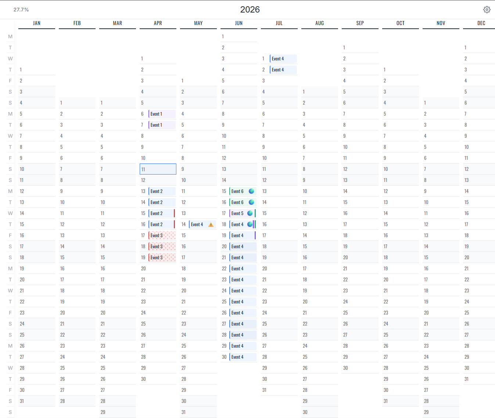

# Calendy - Annual Planner

A beautiful, minimal, and mobile-friendly annual planner built with React, with optional Firebase sync for cross-device access.
Built upon the idea of [calendar by neatnik](https://source.tube/neatnik/calendar).

A publicly hosted version is available at [calendy-79636.web.app](https://calendy-79636.web.app/) if you want to play with it.




## Features

- See your entire year or quarters at a glance in a high-density grid.
- Four curated themes: Modern Blue, Forest (Sepia), Pastel, and Dark Mode.
- Responsive layout across desktop and mobile devices.
- Optional real-time synchronization across all your tabs and devices using Firestore.
- Drag-and-drop to create multi-day events.
- Color-coded categories.
- List view for days with multiple overlapping events.
- Pre-configured GitHub Actions for automated deployment to Firebase Hosting.

## Getting Started

1. **Install and run locally**
   ```bash
   npm install
   npm run dev
   ```
   The app works in guest/local mode without any Firebase configuration.
2. **Optional Firebase configuration for sync across devices**
   - Create a project at [Firebase Console](https://console.firebase.google.com/).
   - Enable **Google Sign-in** in Authentication.
   - Create a **Firestore Database**.
   - Create a `.env.local` file based on `.env.example`.
   - Add the Firebase env vars only if you want sign-in and sync across devices.
   - Deploy the bundled `firestore.rules` before exposing the app publicly.
3. **Optional Google Calendar sync**
   - Set `VITE_GOOGLE_CALENDAR_CLIENT_ID` if you want Calendy to mirror events to Google Calendar.
   - Enable the **Google Calendar API** in Google Cloud, create a Web OAuth client, and add your authorized origins/domains.
4. **Quality checks**
   ```bash
   npm run lint
   npm run typecheck
   npm run test:unit
   ```

## Tech Stack

- **Framework**: React 19 + Vite
- **Database**: Firebase Firestore
- **Authentication**: Firebase Auth (Google)
- **Styling**: Vanilla CSS (Custom Variable System)
- **Deployment**: GitHub Actions + Firebase Hosting
