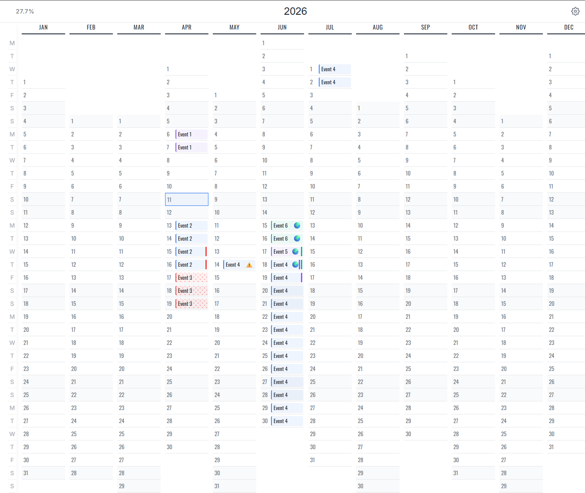

# Calendy - Annual Calendar Viewer

A beautiful, minimal, and mobile-friendly year-at-a-glance view of your Google Calendar.
Built upon the idea of [calendar by neatnik](https://source.tube/neatnik/calendar).

A publicly hosted version is available at [calendy-79636.web.app](https://calendy-79636.web.app/) if you want to play with it.




Calendy is **read-only**. It requests the `calendar.readonly` scope, so it can show your
calendar but can never create, change or delete anything in it.

## Features

- See an entire year or quarter of your Google Calendar at a glance in a high-density grid.
- Full-day events fill the day; shorter events marked with an emoji (✈️, 🚆, 🚩, …) collapse
  into a small pill you can hover or tap to expand.
- Pick which of your calendars to view - it does not have to be the primary one.
- Four curated themes: Modern Blue, Forest (Sepia), Pastel, and Dark Mode.
- Responsive layout across desktop and mobile devices.
- Markdown export of everything in the range you are viewing.
- Pre-configured GitHub Actions for automated deployment to Firebase Hosting.

## How events are displayed

A **leading emoji** is the only signal that matters. Duration decides nothing:
it marks an event as logistics rather than the headline for its days.

| Title | Renders as |
| --- | --- |
| `Brazil` (all-day) | The full-width day chip |
| `Brazil 🇧🇷` (emoji not leading) | Still the chip |
| `🏨 Hotel do Mar` (all-day) | Folded into the day's pill |
| `✈︎ FCO → LIS` (timed) | Folded into the day's pill |
| `Dentist` (timed, no emoji) | Popover content only — too small to own a day |

So a hotel stay booked across the same week as the trip it belongs to steps
aside and lets the trip keep the chip.

A day gets **one** pill no matter how many events fold into it, and it repeats
across every day of a multi-day stay. The pill shows the first marked event's
emoji plus a count when there is more than one; a pill built only from unmarked
events shows the count alone. Hovering, or tapping on touch devices, lists
everything with its time.

Both emoji presentations work and are preserved exactly as typed: `✈︎`
(the monochrome text form, U+FE0E) stays monochrome and `✈️` (U+FE0F)
stays in colour. Flags, skin tones and ZWJ sequences all count as a leading
emoji.

Days holding nothing but unmarked events show nothing by default, which keeps a
year of routine meetings from burying the things worth seeing. **Show a pill on
days with only unmarked events** in settings opts into showing them; either way
they are always in the export.

## Data

- **Events** are fetched from the Google Calendar API and cached in `localStorage` for 30
  minutes, per calendar and per year. They are never written to a server.
- **Settings** - theme, view range, and which calendar you picked - are the only thing
  stored in Firestore, so they follow you across devices.

## Getting Started

1. **Install and run locally**
   ```bash
   npm install
   npm run dev
   ```
2. **Firebase configuration** (required - sign-in is required)
   - Create a project at [Firebase Console](https://console.firebase.google.com/).
   - Enable **Google Sign-in** in Authentication.
   - Create a **Firestore Database**.
   - Create a `.env.local` file based on `.env.example`.
   - Deploy the bundled `firestore.rules` before exposing the app publicly.
3. **Google Calendar access** (required - it is the only data source)
   - Enable the **Google Calendar API** in Google Cloud, create a Web OAuth client, and add
     your authorized origins/domains.
   - Set `VITE_GOOGLE_CALENDAR_CLIENT_ID`.
   - Calendy only ever requests `calendar.readonly`: it can read your calendars and events,
     and can never create, modify or delete anything. The scope is requested at sign-in, so
     tokens can then be refreshed silently.
   - `calendar.readonly` is a **sensitive** scope. Keep the OAuth consent screen in *Testing*
     and add each person who signs in as a test user; publishing would require Google's
     verification review.
4. **Quality checks**
   ```bash
   npm run lint
   npm run typecheck
   npm run test:unit
   ```

## Deploying

`firebase.json` defines two Hosting sites in the same Firebase project:

| Site | Purpose |
| --- | --- |
| `calendy-79636` | Production. Deployed by `firebase-hosting-merge.yml` on push to `master`. |
| `calendy-readonly` | Test deploy, independent of production. Deployed by `firebase-hosting-readonly-test.yml`. |

To create the test site once:

```bash
firebase hosting:sites:create calendy-readonly
```

Then add `https://calendy-readonly.web.app` to **Authentication → Settings → Authorized
domains** in Firebase, and to the **Authorised JavaScript origins** of the Google Cloud
OAuth client. Deploy manually with:

```bash
firebase deploy --only hosting:calendy-readonly
```

## Tech Stack

- **Framework**: React 19 + Vite
- **Calendar data**: Google Calendar API (read-only), cached in `localStorage`
- **Settings storage**: Firebase Firestore
- **Authentication**: Firebase Auth (Google)
- **Styling**: Vanilla CSS (Custom Variable System)
- **Deployment**: GitHub Actions + Firebase Hosting
